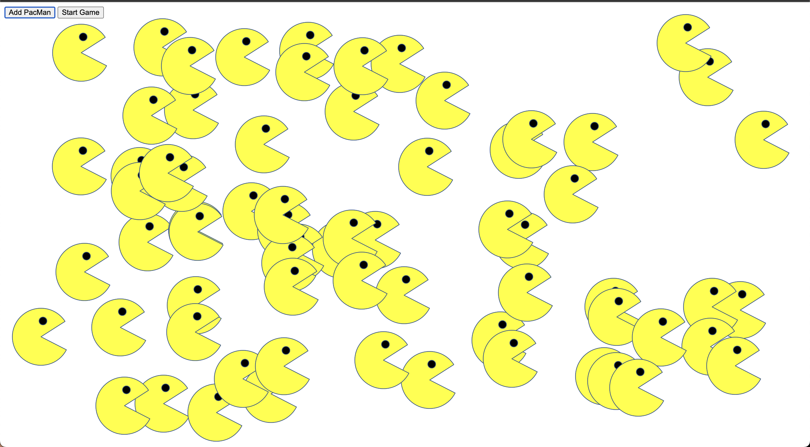

# Pacmen Factory Code Sample

**Intro**

This is a sample of an exercise done during the MIT Professional Certificate in Coding.

The professor provided us with an initial code and this is the result.

**Instructions for making pacmen animation**

When button "Add PacMan" is pressed a pacman will show up on the screen. You can add as many as you wish. 

Next, you click "Start Game" and you will see pacman bouncing off the walls of the browser. 

See the <a href="/license.md">LICENSE</a> file for license rights and limitations (MIT).
